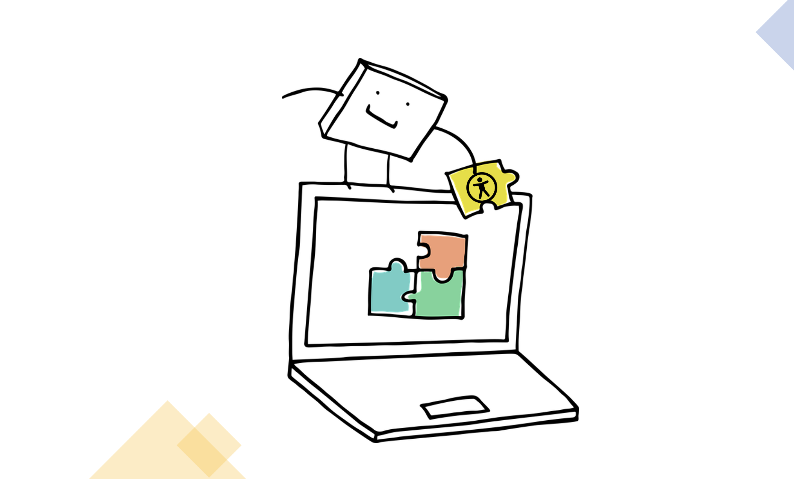
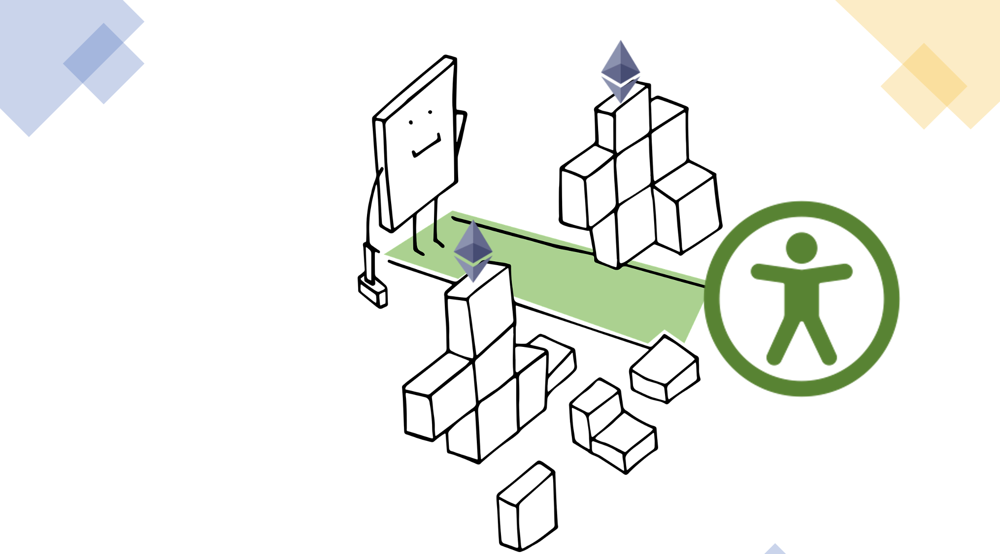

# dapp-clones

Welcome to "dapp-clones", where we explore into the world of decentralized applications (Dapps) and their user experience (UX) design. Our team set out to determine the state of web3 accessibility, as part of pro bono work through our grant from the school **Ethereum Foundation's Ecosystem Support program**.

This sample repository outlines general better practices in Dapp design, ensuring they are not only functional but also accessible to a broader audience, including those with disabilities. From color contrast to navigation, we explore essential design considerations, backed by relevant WCAG 2.2 references, to help you build more inclusive and user-friendly DApps.

 
    

## Categorizing Dapps

In the blockchain space, we have decentralized applications, also knowns as "dapps" for short. These can be decentralized exchanges (dex), NFT marketplaces, staking applications, and so forth. The idea is that dapps tend to gravitate towards categories based on their intended use and functionality. Grouping tendencies into a broader category, allows us to make suggestions for broader types from an accessibility perspective.

For example, a decentralized exchange, features a form and dropdowns as the main piece in its design. That input field should be labeled for the tokens, and the dropdowns should be accessible for keyboard users. NFT markeplaces, as another example, feature carousels. There should be considerations for alternatives, but at a minmum the carousels should ideally be static (not move unless right or left selection).

Each category has its own pieces that can be improved from existing best standards and practices. This repository contains three such categories: exchange (dex), marketplace, and staking dapps. Navigate to each folder to view specific accessibilty recommendations and design, which was formulated from WCAG references and our research study.

| Please note, that the code is currently unaudited. Furthermore, user testing is imperative to fully insure full accessibilty. Our testing suites pass, yet any automated tests can only capture 30% of all errors.|

 
    

## General Better Practices

There are some accessibility enhancements that are generalizable to all dapp categories. This is a list of _some_ considerations. We chose to highlight some of the more common issues we've noticed from the dapp ecosystem. Associated with each point is the corresponding WCAG 2.2 guideline references that most closely relates to it. For a more detailed list with dapp focused examples, please reference our better practices guide which will be released soon.

- **Headings**: Many dapps unfortunately do not follow the proper heading hierarchy. Headings are akin to roadmaps for screenreaders and must maintain the appropriate hierarchy order.[2.4.6]

- **Color Contrast**: If possible, having multiple themes (see stakedapp), allows the user more choice and flexibility. It is important that each theme has proper contrast. At a bare minimum, the UI should have a toggleable light/dark theme with light mode being default as best practice. [1.4.3]

- **Login Button**: Due to the fact that web3 UX has evolved to handle social sign on or email login, it makes more sense to have a login or signup button, as opposed to the prevalent "connect wallet" button.
  Connect wallet can be incorporated as an option in a list of providers (google, twitter, etc). Every part of the modal: form and buttons should be clearly labeled with proper instructions. [3.3.2], [3.3.8]

- **Modal Focus Trap**: When a modal popup is displayed, the user should not be able to tab off of it. In other words the focus should be confined to the popup, with a clear working close button present. [2.1.1],
  [2.4.3], [2.4.7]

- **Site Maps**: No matter how simple the dapp interface is, a site map should still be present. Every dapp at a minimum will still have terms of service, privacy policies, and social links. Dapps that are not single page applications (SPAs), will have other routes, which can be found in the site map of the footer. This is an important guidemap/reference for keyboard and screenreader users. For dapps with greater complexity in navigation bars and sidebars, this becomes even more pertinent.[2.4.5]

- **Reduce Jargon & Unnecessary Technical Terms**: These dapp references are simplified examples. More work is to be done beyond the straightforward functionality. Nevertheless, proper explanations and more beginner-friendly terms are imperative where possible. In our stakedapp we have a dedicated about page for an explanation of the application. Another option, which actually may be preferable, is to feature a banner atop the page with a clear explanation of the purpose and course of action the user can undertake. We leverage a banner in our marketplace dapp.[3.1.5] [3.3.2]

- **Clear Error Handling**: Errors should be clear in meaning and ideally preventative (before user selects confirm). [3.3.3], [3.3.4]

- **Help For User**: There should be some means to contact your team or ask for help, whether it be a link to a forum, a contact form, or otherwise. We've elected to include a contact us section. [3.3.5]

## Navigating This Repo

1. [Exchange (DEX)](https://github.com/DecoratedWings/dapp-clones/tree/main/dex)
2. [Marketplace](https://github.com/DecoratedWings/dapp-clones/tree/main/marketplace)
3. [Staking Application](https://github.com/DecoratedWings/dapp-clones/tree/main/stakedapp)

## Relevant WCAG 2.2 References

- [WCAG 2.2 Main](https://www.w3.org/TR/WCAG22/)
- [1.4.3 Contrast (Minimum)](https://www.w3.org/TR/WCAG22/#contrast-minimum)
- [3.3.2 Labels or Instructions](https://www.w3.org/TR/WCAG22/#labels-or-instructions)
- [2.1.3 Keyboard](https://www.w3.org/TR/WCAG22/#keyboard-no-exception)
- [2.4.3 Focus Order](https://www.w3.org/TR/WCAG22/#focus-order)
- [2.4.6 Headings and Labels](https://www.w3.org/TR/WCAG22/#headings-and-labels)
- [2.4.7 Focus Visible](https://www.w3.org/TR/WCAG22/#focus-visible)
- [2.4.5 Multiple Ways](https://www.w3.org/TR/WCAG22/#multiple-ways)
- [3.1.5 Reading Level](https://www.w3.org/TR/WCAG22/#reading-level)
- [3.3.2 Labels or Instructions](https://www.w3.org/TR/WCAG22/#labels-or-instructions)
- [3.3.3 Error Suggestion](https://www.w3.org/TR/WCAG22/#error-suggestion)
- [3.3.4 Error Prevention (Legal, Financial, Data)](https://www.w3.org/TR/WCAG22/#error-prevention-legal-financial-data)
- [3.3.5 Help](https://www.w3.org/TR/WCAG22/#help)
- [3.3.8 Accessible Authentication](https://www.w3.org/TR/WCAG22/#accessible-authentication-minimum)

## Accessibility is a journey

Accessibility is an ongoing process. Teams must continue to test and review code and processes. If any issues are encountered in this repository, kindly raise an issue or contact our team!

As developers, researchers, engineers, and so forth we must remember that accessibility is a journey. It continues to evolve as our products evolve and requires constant feedback. Assumptions made today can easily be broken tomorrow, however "shifting left" is worth it. Coding with human-centric and inclusive design is worth it.

Let's all make the next generation of the web a more accessible place!

 
    

### Graphics Attribution

- [Modified From manfredsteger's royalty free content](https://pixabay.com/users/manfredsteger-1848497/)
